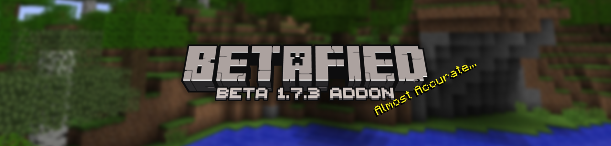

  

### A Porkchop-Powered Love Letter to Minecraft Beta 1.7.3 — Now on Bedrock Edition!

> *"Back when the grass was green, the sky was blue, and Creepers were your worst nightmare..."*

---

**Betafied** is an **open-source**, **community-driven** project dedicated to recreating the iconic **Minecraft Beta 1.7.3** experience — but for **Bedrock Edition**. The goal is to restore the nostalgic charm of 2011 with classic textures, world generation, mechanics, and more.

> 🔓 Released under the [GNU AGPLv3 License](https://www.gnu.org/licenses/agpl-3.0.en.html#license-text) — tweak it, fork it, build something new — it's yours too.

**Betafied** is more than an addon. **It’s a platform shaped by the community**. Whether you're here for the nostolgia, the code, or to build your own vision, welcome to the Golden Age of Minecraft!

---

## 🧩 Features Checklist

Here's where we're at on the mission to revive Beta 1.7.3:

- [X] Authentic World Generation 80% Done!
    Classic biomes, ore spread, oceans, and those janky yet beautiful terrain curves.

- [X] Core Mechanics
    From old-school combat and redstone to farming quirks and mob AI.

+ [X] Classic Visuals & Audio
    OG textures, nostalgic sounds, and that warm fuzzy feeling.

+ [X] Survival Systems
    Beta food mechanics, ~~armor values~~, and mob behavior - restored.

+ [X] Block Behaviors
    Slabs, stairs, and more function just like you remember.

+ [X] Open & Modifiable Codebase
    Designed for tinkering, extending, and remixing.

*Checked items are implemented or foundational. The rest? On the way.*

---

## 📦 Installation Guide

> ⚠️ Due to Bedrock's current limitations, **Betafied requires a bundled world template** to enable custom generation. You can’t use the addon on its own (yet).

---

### 📥 Step 1: Download

👉 [Download the Latest Release](https://github.com/betafied/betafied-addon/releases)  
(*Includes the .mctemplate and the addon bundled together*)

---

### 🧭 Step 2: Choose Your Platform

<strong>📱 Mobile (Android/iOS)</strong>

1. Tap the downloaded `.mcworld` file  
2. Choose **"Open in Minecraft"**  
3. Minecraft will import the world + addon automatically  

<strong>🖥️ Windows 10/11</strong>

1. Double-click the `.mcworld` file  
2. OR drag it into your open Minecraft window  
3. The world will import with the addon pre-enabled  

<strong>🎮 Xbox (via Realms)</strong>

1. On a PC or mobile device:
   - Download the `.mcworld`
   - Upload it to your **Minecraft Realm**

2. On your Xbox:
   - Open Minecraft and go to your Realm
   - Select **Download World**

✅ The world will import with Betafied included and ready to go!

---

### 🎮 Step 3: Play the Game

> 🟩 Just launch the imported world. The addon is pre-configured — no setup needed.

---

## 🤝 Contributing

Want to help bring Beta back? Whether you code, design, test, or meme — we’d love to have you.

### Ways to Contribute:
- 🧠 **Code:** Recreate mechanics, squash bugs, improve performance.
- 🎨 **Assets:** Retro textures, beta audio, old-school models.
- 🐛 **Testing:** Find bugs, suggest features, stress-test mechanics.
- 📚 **Docs:** Help write guides, README updates, or wiki pages.
- 💬 **Support:** Welcome newcomers, answer questions, take back the night!

👉 Read our [CONTRIBUTING.md](CONTRIBUTING.md) for full guidelines.

---

## 📄 License

Betafied is licensed under the **[GNU AGPLv3](LICENSE)**.

> 💡 You’re free to use, modify, and share — but any public mods or forks must also be open-source under the same license.

This keeps Betafied free and open for everyone, forever.

---

## 🌐 Join the Community

> Come for the nostalgia, stay for the chaos.

- 💬 **Discord:** [Join Our Server](https://discord.gg/fEWrZvBF2S) *(Highly Recommended!)*
- 🐛 **Report Issues / Suggest Features:** [GitHub Issues](https://github.com/betafied/betafied-addon/issues)

Got a vision for your own Beta-inspired project? Fork us and run with it. That’s the spirit of Betafied.

---

> *Not affiliated with Mojang or Microsoft. Minecraft is a trademark of Mojang AB. We're just fans keeping the flame alive.* 🔥

---
